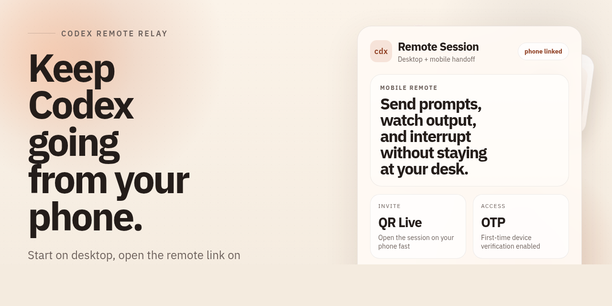

<div align="center">
  <a href="./README.md">English</a> |
  <a href="./README.ko.md">한국어</a> |
  <a href="./README.zh-CN.md">简体中文</a> |
  <a href="./README.ja.md">日本語</a> |
  <a href="./README.es.md">Español</a>
</div>

# cdx

**Codex をもっと手軽に、モバイルからでも。**

<div align="center">
  
</div>

## クイックスタート

### 要件

- Node.js 20+
- Codex のインストール完了: `npm install -g @openai/codex`
- `cloudflared` のインストールが必要
- Linux、macOS 対応

### インストール

```bash
npm install -g @ezpzai/cdx
```

### Cloudflare Quick Tunnel のインストール

`cdx remote` はデフォルトで Cloudflare Quick Tunnel を使います。

macOS:

```bash
brew install cloudflared
```

Linux:

```bash
curl -Lo cloudflared https://github.com/cloudflare/cloudflared/releases/latest/download/cloudflared-linux-amd64
chmod +x cloudflared
sudo mv cloudflared /usr/local/bin/
```

### 最初の利用

```bash
cdx login {profile} // 初回登録が必要
cdx run {profile}
cdx remote // モバイル利用
cdx usage // usage を確認
```

## 主なコマンド

| コマンド | 説明 |
| --- | --- |
| `cdx remote [profile] [codex args...] [--mode <safe\|balanced\|yolo>] [--tunnel <cloudflare\|none>] [--no-qr] [--lan]` | デスクトップで実行中の Codex セッションをモバイル Web に引き継ぎます。 |
| `cdx run [profile] [codex args...] [--mode <safe\|balanced\|yolo>]` | 選択したプロファイルの `CODEX_HOME` で Codex を起動します。 |
| `cdx usage [profile] [--json]` | プロファイルごとの auth と quota 状態を確認します。 |
| `cdx mode` | 現在のデフォルト実行モードを表示します。 |
| `cdx mode set <safe\|balanced\|yolo> [--profile <profile>]` | グローバルまたはプロファイル単位のデフォルト実行モードを保存します。 |
| `cdx login <profile>` | 新しいプロファイルを作成するか、既存プロファイルにログインします。 |
| `cdx logout <profile>` | プロファイルのログアウトを開始します。 |
| `cdx ls` | 検出されたプロファイルを表示します。 |
| `cdx rm <profile> [--force]` | プロファイルを削除します。 |
| `cdx agents edit --global` | 共有グローバル `AGENTS.md` を準備して開きます。 |
| `cdx agents status` | 現在のリポジトリとグローバル `AGENTS.md` の接続状態を確認します。 |

`cdx remote` のデフォルト外部経路は `Cloudflare Quick Tunnel` です。

- 外部リンク: `cdx remote <profile>`
- 同じ Wi-Fi / LAN: `cdx remote <profile> --tunnel none --lan`
- ローカル専用: `cdx remote <profile> --tunnel none`
